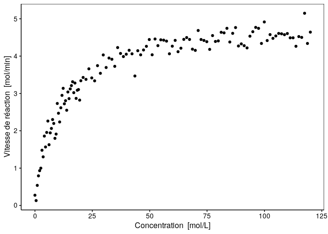

Module 4 - Régression non linéaire : Vitesse de réaction chimique
================

<!--- do not edit readme.md ---->

## Avant-propos

Les consignes sont reprises dans ce document, ainsi que sous forme de
commentaires dans les différents fichiers. Elles sont susceptibles
d’évoluer. N’hésitez pas à vérifier le lien suivant afin de voir si
des modifications n’y ont pas été apportées :
<https://github.com/BioDataScience-Course/B04Ga_speed-reaction>

## Contexte

``` r
speed <- read("data/reaction.rds")
```

Des scientifiques ont déterminé la vitesse d’une réaction chimique en
fonction de la concentration en substrat. Le jeu de données
(`reaction.rds`) mis à votre disposition et détaillé ci-dessous se
trouve dans le dossier `data`.

``` r
skimr::skim(speed)
```

|                                                  |       |
| :----------------------------------------------- | :---- |
| Name                                             | speed |
| Number of rows                                   | 120   |
| Number of columns                                | 2     |
| \_\_\_\_\_\_\_\_\_\_\_\_\_\_\_\_\_\_\_\_\_\_\_   |       |
| Column type frequency:                           |       |
| numeric                                          | 2     |
| \_\_\_\_\_\_\_\_\_\_\_\_\_\_\_\_\_\_\_\_\_\_\_\_ |       |
| Group variables                                  | None  |

Data summary

**Variable type: numeric**

| skim\_variable | n\_missing | complete\_rate |  mean |    sd |   p0 |   p25 |   p50 |   p75 |   p100 | hist  |
| :------------- | ---------: | -------------: | ----: | ----: | ---: | ----: | ----: | ----: | -----: | :---- |
| conc           |          0 |              1 | 50.33 | 37.35 | 0.00 | 15.26 | 45.44 | 82.72 | 120.00 | ▇▃▃▃▃ |
| speed          |          0 |              1 |  3.60 |  1.14 | 0.13 |  3.00 |  4.09 |  4.44 |   5.15 | ▁▂▃▃▇ |

Avec ces données, le graphique ci-dessous, qui sera la base de votre
recherche, a été réalisé. Les scientifiques ont maintenant besoin de
vous pour déterminer les paramètres de la régression non linéaire.

``` r
chart(speed, speed ~ conc) +
  geom_point()
```

<!-- -->

## Objectif

Ce projet est un projet **individuel**, **court** et **cadré** qui doit
être **terminé pour la fin du module 4**.

Dans le cadre de cet exercice, vous devez analyser la situation mise à
votre disposition et consignez vos résultats sous la forme d’un carnet
de laboratoire au format Rmd. Ce document, nommé `speed_reaction.Rmd`,
se trouve dans le dossier `docs`.

Afin de cadrer votre recherche, tentez de réaliser une régression non
linéaire qui suit l’équation proposée par Michaelis-Menten.

La courbe de Michaelis-Menten, bien connue pour modéliser des cinétiques
chimiques simples dont certaines réactions enzymatiques, suit l’équation
suivante :

\[V = \frac{V_{max} * conc}{K + conc}\]

où \(conc\) est la concentration en mol/L des réactifs au début de la
réaction, c’est-à-dire en absence du produit de cette réaction, \(V\)
est la vitesse de réaction en mol/min. Ce modèle a deux paramètres
\(V_{max}\) la vitesse maximale asymptotique en mol/min et \(K\) en
mol/L correspondant à la concentration telle que la vitesse est la
moitié de \(V_{max}\).

Votre carnet de laboratoire doit débuter par une courte introduction sur
l’équation de Michaelis-Menten (ajoutez-y l’équation). Vous devez
ensuite décrire les différentes étapes que vous allez réaliser.
